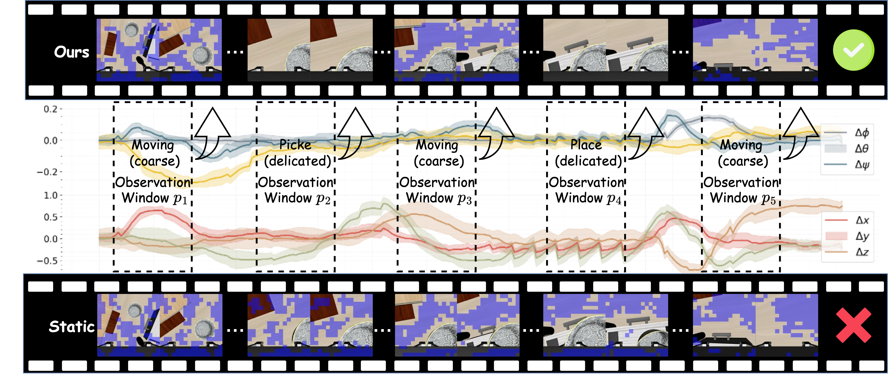
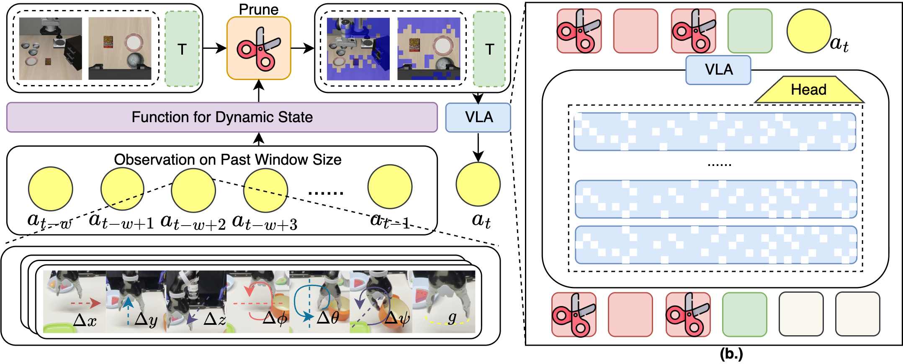
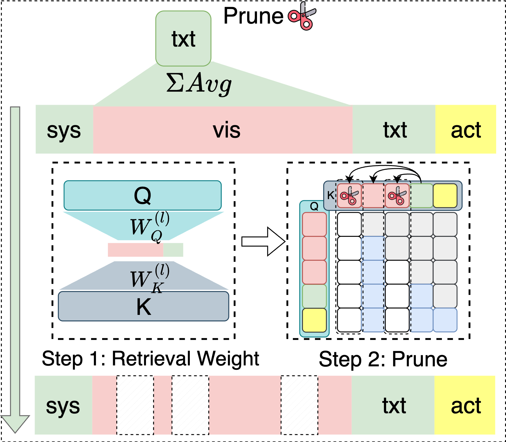
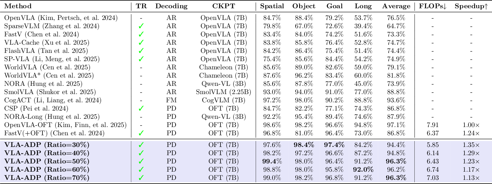

# <div align="center">ICLR 2026: Action-aware Dynamic Pruning for Efficient Vision-Language-Action Manipulation</div>

<div align="center">

[](https://github.com/TerryPei/VLA-ADP)
[](https://arxiv.org/pdf/2509.22093)
[](LICENSE.txt)

**Xiaohuan Pei\*, Yuxing Chen\*, Siyu Xu, Yunke Wang, Yuheng Shi, Chang Xu**

</div>

<p align='center'>

</p>

**Action-aware Dynamic Pruning (ADP)** is a training-free, plug-and-play method for efficient VLAs. It adaptively prunes redundant visual tokens across manipulation stages by combining text-driven token relevance with an action-aware gating signal from end-effector motion—reducing FLOPs and latency while preserving task success. ADP works out-of-the-box with parallel decoding (e.g., OpenVLA-OFT).

<p align='center'>
  
  
</p>

---


# 🎯 Overview

Vision–Language–Action (VLA) models extend large vision–language models to map visual observations and language instructions into executable robot actions. In the mainstream pipeline, a vision encoder produces dense visual tokens, a projector aligns them to the language space, and an LLM fuses modalities to predict actions. However, long multi-modal sequences introduce substantial redundancy in visual tokens, increasing computation, memory usage, and latency.

**Action-aware Dynamic Pruning (ADP)** is a training-free, plug-and-play method for efficient VLAs. It adaptively prunes redundant visual tokens across manipulation stages by Action-aware gating signals derived from end-effector motion.  

ADP significantly reduces FLOPs and latency while preserving task success rates. It works seamlessly with parallel decoding frameworks such as OpenVLA-OFT.

<p align='center'>

</p>

<p align='center'>

</p>

---


# 🛠 Installation

Our installation procedure follows the official OpenVLA-OFT repository:

👉 https://github.com/moojink/openvla-oft.git

Please refer to their instructions for environment setup, dependency installation, and checkpoint preparation.

---

## ⚠️ Possible Issues

If you have modified the `prismatic` module (or any core model implementation) before, please remember to **reinstall** the package in editable mode:

```bash
pip install -e .
```

---

# 🔍 Experimental Results

## Simulation (LIBERO)

- 50–70% keep → ≤0.9% SR drop, up to **1.23×** LLM speedup  
- 30–40% keep → **94.4–94.8% SR**, **1.29–1.35×** speedup  
- Spatial suite reaches **99.4% SR**

## Real-World (4 Tasks)

- SR improves from **85.8% → 88.3%**
- Latency reduces from **76.9 → 51.8 ms** (**1.49× speedup**)

---

# 🧪 PRUNE_V2 Evaluation

After finishing the OpenVLA-OFT installation, please replace the following folders in your OpenVLA-OFT directory with the ones provided in this repository:

- `experiments/`
- `prismatic/`

## Run PRUNE_V2

```bash
python experiments/robot/libero/run_libero_eval_prune_v2.py \
  --pretrained_checkpoint <checkpoint_path> \
  --task_suite_name libero_spatial \
  --qk_config_json experiments/robot/libero/configs/prune_v2_config.json
```

(Similar commands apply to libero_object, libero_goal, libero_10.)

---

## PRUNE_V2 Configuration

```json
{
  "qk_keep_enabled": true,
  "qk_layer": 0,
  "qk_keep_ratio": 0.75,
  "qk_keep_split": [0.4, 0.6],
  "qk_log_topk": 16,
  "qk_debug": false,
  "task_suite_name": "libero_spatial",

  "use_dynamic_visual_strategy": true,
  "decision_method": "adjacent",
  "adjacent_variant": "extrema",
  "adjacent_extrema_window": 3,
  "adjacent_lookback": 2,
  "initial_state": 0,
  "delta_method": "net",
  "L_eff": 0.15,
  "min_delta_pos": 0.0,
  "min_delta_rot": 0.0,
  "hysteresis_up": 0.0,
  "hysteresis_down": 0.0,
  "tol_equal": 0.0
}
```
---

# 📊 Analysis

- **Retrieval Layer Study (qk_layer = 0–32)**  
  🔗 [Scripts](https://drive.google.com/drive/folders/1WXCHnLB4h5SWbxPbIm5jO6MdFyyb9z3D?usp=sharing) |  
  📄 [Logs](https://drive.google.com/drive/folders/19lb6SNFAEOcZJuo2RIRUUXMbvKol6yW-?usp=sharing)

- **Object Lookback Sweep (Object Suite, Window = 4–10)**  
  🔗 [Scripts](https://drive.google.com/drive/folders/1WXCHnLB4h5SWbxPbIm5jO6MdFyyb9z3D?usp=sharing) |  
  📄 [Logs](https://drive.google.com/drive/folders/1XQqPWX70qlOG0ZXRovsw5quyM0b0fTnS?usp=sharing)

- **Trade-off (Static Pruning)**  
  🔗 [Scripts](https://drive.google.com/drive/folders/1WXCHnLB4h5SWbxPbIm5jO6MdFyyb9z3D?usp=sharing) |  
  📄 [Logs](https://drive.google.com/drive/folders/1fhWOEvCnEWXXLRe97cxi2Lu-vvEJUptY?usp=sharing)

- **Trade-off (ADP Dynamic Pruning)**  
  🔗 [Scripts](https://drive.google.com/drive/folders/1WXCHnLB4h5SWbxPbIm5jO6MdFyyb9z3D?usp=sharing) |  
  📄 [Logs](https://drive.google.com/drive/folders/1DLx4LLgJQcK-mJ2CCZA36NZsbUk4hqkW?usp=sharing)

- **Threshold Sweep (Pruning Ratio Sensitivity)**  
  🔗 [Scripts](https://drive.google.com/drive/folders/1WXCHnLB4h5SWbxPbIm5jO6MdFyyb9z3D?usp=sharing) |  
  📄 [Logs](https://drive.google.com/drive/folders/15X3wASfcTIWGeVmxt2oN8o8lIGGFIx9P?usp=sharing)

- **Window Keep Ablation (adjacent_lookback Sweep)**  
  🔗 [Scripts](https://drive.google.com/drive/folders/1WXCHnLB4h5SWbxPbIm5jO6MdFyyb9z3D?usp=sharing) |  
  📄 [Logs](https://drive.google.com/drive/folders/1MTktRR8T3vfxZYjL_qsmV3Qw_VtY-Too?usp=sharing)

- **Spatial Lookback Sweep (Spatial Suite, Window = 4–10)**  
  🔗 [Scripts](https://drive.google.com/drive/folders/1WXCHnLB4h5SWbxPbIm5jO6MdFyyb9z3D?usp=sharing) |  
  📄 [Logs](https://drive.google.com/drive/folders/1jZADLfFrbIMNyAKa2MjHcFMbZeuc3e2J?usp=sharing)

- **Main Table Ablation (Full Benchmark Comparison)**  
  🔗 [Scripts](https://drive.google.com/drive/folders/1WXCHnLB4h5SWbxPbIm5jO6MdFyyb9z3D?usp=sharing) |  
  📄 [Logs](https://drive.google.com/drive/folders/1CZBSQuyPEAuHnWO4d3Q2OQi6VOPKh8mV?usp=sharing)

---

# 📖 Citation

```bibtex
@article{pei2025action,
  title={Action-aware dynamic pruning for efficient vision-language-action manipulation},
  author={Pei, Xiaohuan and Chen, Yuxing and Xu, Siyu and Wang, Yunke and Shi, Yuheng and Xu, Chang},
  journal={arXiv preprint arXiv:2509.22093},
  year={2025}
}
```

---

# 🤝 Acknowledgements

We build upon:

- OpenVLA  
- OpenVLA-OFT  
- Hugging Face Transformers  

---

# 📜 License

Apache 2.0 License