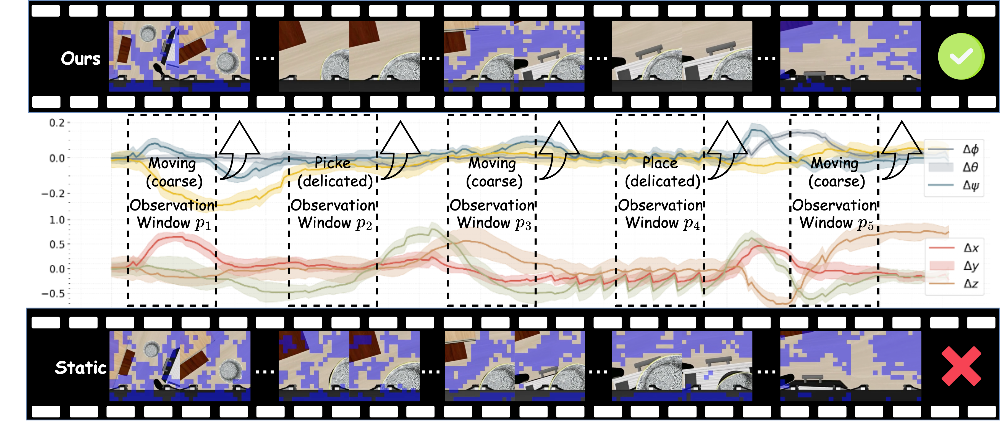
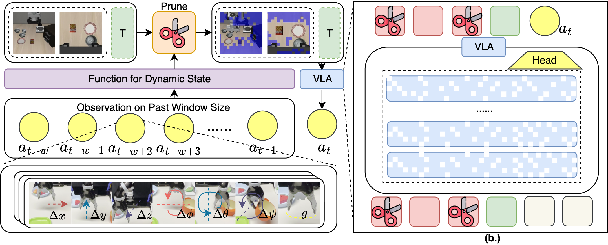
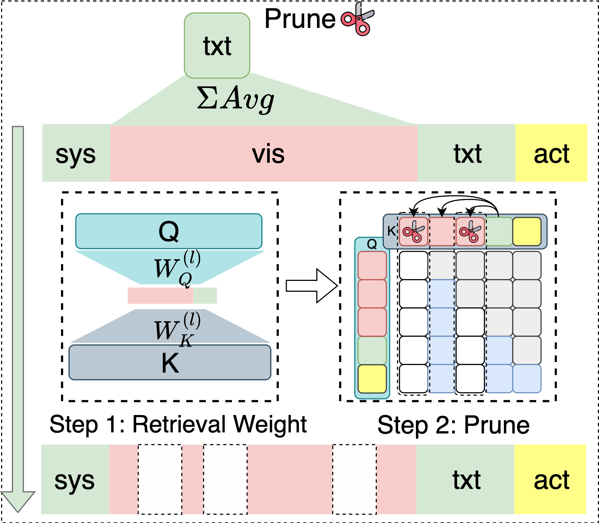
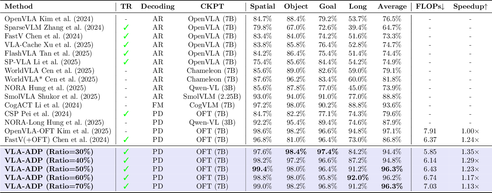
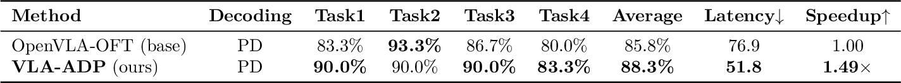
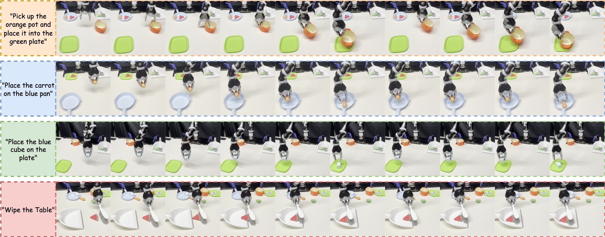

# <div align="center">Action-aware Dynamic Pruning for Efficient Vision-Language-Action Manipulation</div>

<div align="center">

[](https://github.com/chen7086/VLA-ADP) [](https://arxiv.org/abs/xxxx.xxxxx) [](LICENSE.txt)

**Xiaohuan Pei, Yuxing Chen, Siyu Xu, Yunke Wang, Yuheng Shi, Chang Xu**

</div>

<div align="center">
  <strong>🔥 Action-aware Dynamic Pruning is a training-free, plug-and-play solution for accelerating vision-language-action models.</strong>
</div>

---

#  Analysis

- **Retrieval Layer Study (qk_layer = 0–32)**  
  🔗 [Scripts](https://drive.google.com/drive/folders/1WXCHnLB4h5SWbxPbIm5jO6MdFyyb9z3D?usp=sharing) |  📄 [Logs](https://drive.google.com/drive/folders/19lb6SNFAEOcZJuo2RIRUUXMbvKol6yW-?usp=sharing)


- **Object Lookback Sweep (Object Suite, Window = 4–10)**  
    🔗 [Scripts](https://drive.google.com/drive/folders/1WXCHnLB4h5SWbxPbIm5jO6MdFyyb9z3D?usp=sharing) |   📄 [Logs](https://drive.google.com/drive/folders/1XQqPWX70qlOG0ZXRovsw5quyM0b0fTnS?usp=sharing)

- **Trade-off (Static Pruning)**  
  🔗 [Scripts](https://drive.google.com/drive/folders/1WXCHnLB4h5SWbxPbIm5jO6MdFyyb9z3D?usp=sharing) |  📄 [Logs](https://drive.google.com/drive/folders/1fhWOEvCnEWXXLRe97cxi2Lu-vvEJUptY?usp=sharing)

- **Trade-off (ADP Dynamic Pruning)**  
  🔗 [Scripts](https://drive.google.com/drive/folders/1WXCHnLB4h5SWbxPbIm5jO6MdFyyb9z3D?usp=sharing) |  📄 [Logs](https://drive.google.com/drive/folders/1DLx4LLgJQcK-mJ2CCZA36NZsbUk4hqkW?usp=sharing)

- **Threshold Sweep (Pruning Ratio Sensitivity)**  
  🔗 [Scripts](https://drive.google.com/drive/folders/1WXCHnLB4h5SWbxPbIm5jO6MdFyyb9z3D?usp=sharing) |  📄 [Logs](https://drive.google.com/drive/folders/15X3wASfcTIWGeVmxt2oN8o8lIGGFIx9P?usp=sharing)

- **Window Keep Ablation (adjacent_lookback Sweep)**  
  🔗 [Scripts](https://drive.google.com/drive/folders/1WXCHnLB4h5SWbxPbIm5jO6MdFyyb9z3D?usp=sharing) |  📄 [Logs](https://drive.google.com/drive/folders/1MTktRR8T3vfxZYjL_qsmV3Qw_VtY-Too?usp=sharing)

- **Spatial Lookback Sweep (Spatial Suite, Window = 4–10)**  
  🔗 [Scripts](https://drive.google.com/drive/folders/1WXCHnLB4h5SWbxPbIm5jO6MdFyyb9z3D?usp=sharing) |  📄 [Logs](https://drive.google.com/drive/folders/1jZADLfFrbIMNyAKa2MjHcFMbZeuc3e2J?usp=sharing)

- **Main Table Ablation (Full Benchmark Comparison)**  
  🔗 [Scripts](https://drive.google.com/drive/folders/1WXCHnLB4h5SWbxPbIm5jO6MdFyyb9z3D?usp=sharing) |  📄 [Logs](https://drive.google.com/drive/folders/1CZBSQuyPEAuHnWO4d3Q2OQi6VOPKh8mV?usp=sharing)

---


## 🎯 Overview

Vision–Language–Action (VLA) models extend large vision–language models to map visual observations and language instructions to executable robot actions. In the mainstream pipeline, a vision encoder yields dense visual tokens, a projector aligns them to the language space, and an LLM fuses modalities to predict actions—yet the long multi-modal sequences introduce many redundant visual tokens, inflating compute, memory, and latency.

<p align='center'>

</p>

**Action-aware Dynamic Pruning (ADP)** is a training-free, plug-and-play method for efficient VLAs. It adaptively prunes redundant visual tokens across manipulation stages by combining text-driven token relevance with an action-aware gating signal from end-effector motion—reducing FLOPs and latency while preserving task success. ADP works out-of-the-box with parallel decoding (e.g., OpenVLA-OFT).

<p align='center'>
  
  
</p>

---

## 🔍 Experiment Results

We evaluate ADP on LIBERO simulation and a 4-task real-robot benchmark under standardized settings, comparing to baselines and reporting success rate (SR), FLOPs, and action latency.

**Simulation (LIBERO):** ADP delivers a stable accuracy–compute trade-off across retention ratios. With 50–70% keep, average SR decreases by ≤0.9% while LLM-side speed improves up to 1.23× and FLOPs drop below the baseline. With 30–40% keep, ADP maintains 94.4–94.8% average SR and achieves 1.29–1.35× speedup. Notably, SR reaches 99.4% on Spatial, indicating effective pruning of redundant visual tokens while preserving task-critical cues.

<p align='center'>

</p>

<p align='center'>

</p>

**Real world (4 tasks):** ADP improves average SR from 85.8% to 88.3% and reduces latency from 76.9 to 51.8 (1.49× speedup). It outperforms the baseline on Task1/3/4 (90.0%, 90.0%, 83.3%) and is competitive on Task2.

Below we provide the main simulation table and qualitative visualization, followed by the real-world table and visualization.

<p align='center'>

</p>

<p align='center'>

</p>

<!-- ---

## 🎥 LIBERO Demos

<table>
  <tr>
    <td width="25%">
      <video controls muted playsinline width="100%">
        <source src="./assests/2025_09_11-20_01_43--openvla_oft--episode=9--success=True--task=pick_up_the_black_bowl_next_to_the_plate_and_place.mp4" type="video/mp4" />
      </video>
    </td>
    <td width="25%">
      <video controls muted playsinline width="100%">
        <source src="./assests/2025_09_11-19_57_31--openvla_oft--episode=6--success=True--task=pick_up_the_tomato_sauce_and_place_it_in_the_baske.mp4" type="video/mp4" />
      </video>
    </td>
    <td width="25%">
      <video controls muted playsinline width="100%">
        <source src="./assests/2025_09_11-19_47_37--openvla_oft--episode=4--success=True--task=open_the_top_drawer_and_put_the_bowl_inside.mp4" type="video/mp4" />
      </video>
    </td>
    <td width="25%">
      <video controls muted playsinline width="100%">
        <source src="./assests/2025_09_11-19_42_44--openvla_oft--episode=7--success=True--task=put_the_white_mug_on_the_plate_and_put_the_chocola.mp4" type="video/mp4" />
      </video>
    </td>
  </tr>
</table> -->

---

## 📖 Citation

If you find this work useful, please cite:
```bibtex
@article{xu2025vla,
  title={Action-aware Dynamic Pruning for Efficient Vision-Language-Action Manipulation},
  author={Pei, Xiaohuan and Chen, Yuxing and Xu, Siyu and Wang, Yunke and Shi, Yuheng and Xu, Chang},
  journal={arXiv preprint arXiv:xxxx.xxxxx},
  year={2025}
}
```

---

## 🤝 Acknowledgements

We build on the amazing work of [OpenVLA](https://github.com/openvla/openvla), [OpenVLA-OFT](https://github.com/moojink/OpenVLA-OFT), and [Huggingface Transformers](https://github.com/huggingface/transformers).

---

## 📜 License

This project is licensed under the [Apache 2.0 License](LICENSE).


